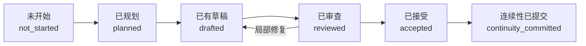

# Codex Novel｜AI 小说创作工作流

一个面向中文商业小说创作的 **Codex 原生、本地优先、可恢复** 工作流。

项目目前重点服务两类内容平台与两种创作形态：

| 平台方向 | 长篇连载 | 短篇完结 |
| --- | --- | --- |
| 番茄小说 | 支持 | 支持 |
| 知乎盐选 | 支持 | 支持 |

它不是一个“输入题目、一次生成整本小说”的文本生成器，而是一套把 **市场选题、作品设定、逐章创作、质量复核、角色状态、剧情状态和最终导出** 串联起来的生产系统。

Codex 负责理解、策划、写作、审稿和局部修复；`novelctl` 负责确定性的状态检查、阶段推进、连续性提交、故障恢复、检索索引、检查点和导出。所有关键内容都保存在本地 Markdown/YAML 文件中，作者可以阅读、修改、版本管理，也可以随时停止后继续。

> 当前版本：`0.3.0`，处于可运行的工程验证阶段。项目尚未接入番茄小说或知乎盐选的自动发布接口，也不承诺平台流量、签约结果或作品收入。

## 为什么要做这个项目

普通 AI 写作对话很容易出现以下问题：

- 写到后面忘记前文设定；
- 角色年龄、伤势、关系和秘密发生漂移；
- 已死亡角色无解释重新出现；
- 伏笔被遗忘，或者还没铺垫就提前揭晓；
- 修改前面的设定后，后续内容仍沿用旧版本；
- 长篇上下文越来越大，成本增加但准确度反而下降；
- 只会生成正文，缺少选题判断、章节验收和可恢复的生产流程。

Codex Novel 将小说创作拆成一组可验证的阶段，并把“聊天中的记忆”转换为可以保存、检查和回滚的项目文件。

## 核心能力

### 1. 市场证据驱动的选题

新项目不会默认采用作者提出的第一个点子。商业项目需要先完成：

1. 带日期和来源的市场扫描；
2. 3～8 个候选选题的对比评分；
3. 平台、文体、读者和内容频道匹配；
4. 差异化与原创边界检查；
5. 选中方案、淘汰方案和取舍理由记录；
6. 可验证的目标读者测试假设。

市场热度只作为搜索方向，不能替代具体故事的需求证明；竞品只能用于判断类型和读者预期，不能复制其剧情、人物系统、组织设定或标志性表达。

### 2. 长篇和短篇使用同一套可靠底座

平台与文体是两个独立维度，而不是绑定关系：

- `fanqie`：番茄小说方向；
- `zhihu-salt`：知乎盐选方向；
- `long-serial`：长篇连载；
- `short-complete`：短篇完结。

两种文体都使用“规划 → 写作 → 审查 → 验收 → 连续性提交”的基本链路，但验收重点不同：

| 项目 | 长篇连载 | 短篇完结 |
| --- | --- | --- |
| 生产单位 | 章节 | 章节或段落 |
| 核心目标 | 持续追读、阶段升级、长期伏笔 | 高压缩、强因果、反转与结尾兑现 |
| 开篇检查 | 前三章里程碑 | 全篇整体复核 |
| 连续性 | 跨章持续累积 | 全篇状态一致 |
| 完成条件 | 当前连载目标完成 | 故事完整闭环 |

### 3. 开篇钩子实验

入选题材在简介批准前还要比较 2～3 个不同开篇。系统记录每个开篇的假设、目标情绪、读者问题、匿名盲测流程、可观察成功信号，以及最终选择和淘汰原因。

没有真实目标读者参与时，只能记录为作者决策或内部预测，不能伪装成盲测数据。

### 4. 动态角色卡与剧情卡

角色卡和剧情卡不是创建后不再变化的静态提示词，而是跟随已经验收的正文持续更新。

系统维护七类连续性数据：

| 数据 | 主要记录内容 |
| --- | --- |
| `characters.yaml` | 角色生死、伤势、位置、目标、知识和状态变化 |
| `story-cards.yaml` | 剧情阶段、关键节拍、兑现债务和当前进度 |
| `facts.yaml` | 已经在正文中成立的事实 |
| `timeline.yaml` | 事件顺序、时间和因果关系 |
| `threads.yaml` | 伏笔、悬念、子情节及其状态 |
| `resources.yaml` | 钱、物品、证据、能力等资源变化 |
| `relationships.yaml` | 角色关系与关系变化 |

这些数据只在章节正文通过审查并被作者接受后提交。计划中的事件、审稿建议和被废弃的草稿不会自动变成“既定事实”。

稳定身份与动态状态分开保存：

- `planning/characters/<角色ID>.yaml` 保存动机、道德底线、决策习惯、说话节奏和 OOC 风险；
- `continuity/characters.yaml` 只保存生死、位置、伤势、目标和知识等会随剧情变化的状态；
- 每章根据明确的参与角色选择性加载档案，不会把所有角色资料都塞入上下文。

### 5. 跨卷情节与人物弧线

长篇连载在进入正文生产前需要建立 `planning/arc-grid.yaml`，把主线、支线、谜团、关系线和角色弧连接到各卷：

- 每卷需要推进的节拍；
- 已经向读者作出的承诺；
- 依赖的人物和剧情线；
- 计划兑现位置与兑现债务；
- 最近推进章节和最大允许闲置章数。

弧线网格只负责规划未来；动态剧情卡负责记录已经发生的事实，两者不能互相覆盖。系统会报告超过闲置上限的活跃剧情线。

### 6. 防止角色错乱和“死而复生”

在生成下一章上下文前，系统会读取角色生命状态和本章出场合同：

- 已死亡角色不能作为当前时间线中的在场角色重新登场；
- 普通连续性更新不能把角色从“死亡”直接改回“存活”；
- 回忆、梦境、录音、遗书或他人转述等非在场形式，需要在章节合同中明确标记；
- 角色知道什么、不知道什么，会作为独立状态参与上下文筛选；
- 修改已验收正文后，相关指纹会失效，系统会阻止继续沿用旧状态。

这套机制不能替代作者判断，但能把高风险错误从“写完以后才发现”提前到章节生产之前。

### 7. 有界上下文，而不是把整本书反复塞给模型

每次写作只组装当前章节真正需要的内容：

- 当前章节合同；
- 场景列表、情绪目标和每场价值变化；
- 上一章交接信息；
- 当前卷计划窗口；
- 本章参与角色；
- 相关事实、资源、关系和未解决剧情线；
- 必要的世界规则；
- 本章参与角色的稳定语言与行为档案；
- 与场景类型匹配且已声明授权来源的微型风格样例；
- 明确记录的未知项与省略项。

这样可以减少长篇创作中的无关信息干扰，也让“为什么本章知道这些信息”可以被检查。

系统还提供可删除、可重建的 SQLite 全文检索索引。索引只负责寻找较早的交接、连续性条目和角色档案；每条结果都要重新校验源文件指纹，索引无权修改剧情状态。

### 8. 可恢复的状态机与命名版本

作品级阶段：


章节级阶段：



下一章只有在上一章完成连续性提交后才会解锁。状态推进失败时，应该补齐缺少的产物，而不是手工修改 `novel-state.yaml`。

连续性提交采用带日志的多文件事务：

1. 校验最终正文及其 SHA-256 指纹；
2. 快照当前状态和所有将被修改的连续性文件；
3. 写入待提交标记；
4. 应用确定性的状态变化；
5. 最后提交作品状态；
6. 清除待提交标记并记录事件。

如果中途异常，可以使用 `recover` 恢复到提交前快照。

作者还可以为大改建立命名修订版本。每个版本保存权威文件指纹和相对上一版本的差异摘要。执行恢复时，系统会先自动保存“恢复前版本”，再恢复目标文件并使旧检索索引失效。

### 9. 连载库存与发布后学习

长篇根据“已连续性提交章节数－已发布章节数”计算真实可发布库存、缓冲天数和红黄绿健康状态。草稿和未验收正文不会计入库存。

发布数据采用本地、主动导入方式。系统不会自动上传作品指标，也不会根据少量数据直接改写已批准定位；它只生成带原始假设和复盘问题的学习底稿。

## 系统架构

```text
Codex
  ├─ 读取写作 Skill
  ├─ 进行选题、规划、写作、审稿和局部修复
  └─ 调用 novelctl 执行确定性操作
       └─ 小说工作区
          ├─ discovery/       市场扫描与选题决策
          ├─ planning/        简介、人物、世界与卷计划
          ├─ chapters/        合同、上下文、草稿、审查与正文
          ├─ continuity/      动态角色卡、剧情卡与连续性账本
          ├─ publication/     连载计划与作者导入的发布指标
          ├─ imports/         尚未成为权威正文的已有稿件
          ├─ reports/         里程碑和质量报告
          ├─ runtime/         事务快照、事件与恢复信息
          └─ exports/         仅由已提交正文生成的导出文件
```

设计边界：

- Codex 是唯一的创作与推理引擎；
- 项目不内置第二套 Agent 运行时；
- 项目不直接调用模型供应商 SDK；
- Markdown/YAML 是权威数据；
- 索引、报告和缓存都是可重新生成的派生结果；
- 同一章节保持串行生产，避免多个写作任务同时修改连续性。

更完整的状态与事务说明见 [ARCHITECTURE.md](ARCHITECTURE.md)。

## 快速开始

### 环境要求

- Git
- Node.js `22` 或更高版本
- npm
- 可以读取本地项目文件并执行命令的 Codex 环境

### 1. 获取并构建

```bash
git clone https://github.com/tiandaoyouchang-png/AI-novel.git
cd AI-novel/plugins/codex-novel
npm install
npm run build
cd ../..
```

当前包是仓库内的开发版本，尚未发布为公共 npm 包。请直接使用仓库内构建得到的 `dist/novelctl.cjs`。

### 2. 先运行示例

仓库提供了中文商业小说样例《盐火照夜》：

```bash
node plugins/codex-novel/dist/novelctl.cjs status examples/commercial-demo
node plugins/codex-novel/dist/novelctl.cjs validate examples/commercial-demo
node plugins/codex-novel/dist/novelctl.cjs topics examples/commercial-demo
node plugins/codex-novel/dist/novelctl.cjs hooks examples/commercial-demo
node plugins/codex-novel/dist/novelctl.cjs arcs examples/commercial-demo
node plugins/codex-novel/dist/novelctl.cjs cards examples/commercial-demo
node plugins/codex-novel/dist/novelctl.cjs cadence examples/commercial-demo
node plugins/codex-novel/dist/novelctl.cjs index examples/commercial-demo
node plugins/codex-novel/dist/novelctl.cjs search examples/commercial-demo --query "青盐 夜航簿"
node plugins/codex-novel/dist/novelctl.cjs milestone examples/commercial-demo --type opening-three
```

导出已经完成连续性提交的正文：

```bash
node plugins/codex-novel/dist/novelctl.cjs export examples/commercial-demo --format md
node plugins/codex-novel/dist/novelctl.cjs export examples/commercial-demo --format txt
node plugins/codex-novel/dist/novelctl.cjs export examples/commercial-demo --format docx
node plugins/codex-novel/dist/novelctl.cjs export examples/commercial-demo --format epub
```

### 3. 创建自己的项目

```bash
node plugins/codex-novel/dist/novelctl.cjs init novels/my-story --title "我的小说"
```

不熟悉命令时，也可以运行交互式引导：

```bash
node plugins/codex-novel/dist/novelctl.cjs guide
```

然后在 Codex 中使用下面的起始指令：

```text
请先完整读取
plugins/codex-novel/skills/write-long-form-novel/SKILL.md，
然后按照其中的工作流继续 novels/my-story。

目标平台：番茄小说
创作形态：长篇连载
暂时不要直接写正文，先完成市场扫描、候选选题、选题决策和 2～3 个开篇钩子实验。
```

知乎盐选短篇示例：

```text
请使用 Codex Novel 工作流创建一个知乎盐选方向的短篇完结故事。
先比较至少 3 个原创选题，说明目标读者、核心情绪、差异化和结尾兑现，
等我确认选题后再建立正式设定与正文。
```

如果已有工作区，优先让 Codex 从真实状态继续：

```text
请读取 Codex Novel Skill，检查 novels/my-story 的 status、validate 和 cards，
保留所有已经验收的正文与设定，只建议一个可恢复的下一步。
```

## 完整创作流程

### 阶段一：市场与选题

```text
市场扫描
  → 候选题材
  → 对比评分
  → 原创边界
  → 选题决策
  → 多开篇钩子实验
  → 市场定位
```

关键文件：

- `discovery/market-scan.yaml`
- `discovery/topic-candidates.yaml`
- `discovery/topic-decision.yaml`
- `discovery/hook-experiments.yaml`
- `planning/market-position.yaml`

运行检查：

```bash
node plugins/codex-novel/dist/novelctl.cjs topics novels/my-story
node plugins/codex-novel/dist/novelctl.cjs hooks novels/my-story
```

### 阶段二：作品基础

Codex 与作者共同确认：

- 作品简介和读者承诺；
- 核心故事引擎；
- 世界规则；
- 角色阵容；
- 当前卷或短篇整体计划；
- 长篇跨卷主线、支线和角色弧网格；
- 质量规则和平台字数范围。

每次上游决策发生实质变化，都应让相关下游产物失效并重新审批，不能静默覆盖。

### 阶段三：逐章生产

每章严格按以下顺序进行：

```text
章节合同与场景细纲
  → 有界上下文
  → 草稿
  → 机械质量检查
  → 结构化审稿
  → 局部修复
  → 最终正文
  → 连续性变化
  → 结构化章节交接
  → 作者接受
  → 连续性提交
```

系统默认最多进行两轮审查和修复；仍有阻断问题时，应暂停并交由作者决定，而不是无限自动重写。

章节审查必须分别给出人物声音、信息边界和场景价值变化的正文证据。通过审查后，`handoff.yaml` 会记录已解决事项、未解决事项、角色承接状态、情绪承接和下一章约束，并绑定最终正文指纹。

### 阶段四：里程碑复核

长篇前三章完成连续性提交后：

```bash
node plugins/codex-novel/dist/novelctl.cjs milestone novels/my-story --type opening-three
```

复核内容包括：

- 目标读者匹配；
- 开篇钩子；
- 主角主动性；
- 爽点或情绪兑现密度；
- 冲突升级；
- 情感投入；
- 文风辨识度；
- 继续阅读意愿。

机械报告只能证明流程和数据完整，不能自动判断文学质量。内部评审通过，也仍然需要真实目标读者测试。

短篇不强制套用“前三章”标准，而是在全文完成后检查开篇吸引力、压缩程度、因果链、情绪升级、反转和结尾兑现。

```bash
# 短篇完整验收
node plugins/codex-novel/dist/novelctl.cjs milestone novels/my-story --type short-complete

# 长篇卷级验收，并生成卷末检查点
node plugins/codex-novel/dist/novelctl.cjs milestone novels/my-story --type volume
```

查看长篇剧情线是否闲置、库存是否健康：

```bash
node plugins/codex-novel/dist/novelctl.cjs arcs novels/my-story
node plugins/codex-novel/dist/novelctl.cjs cadence novels/my-story
node plugins/codex-novel/dist/novelctl.cjs cadence novels/my-story --published-through 20
```

## `novelctl` 命令

大多数命令使用以下形式；`revision` 和 `metrics import` 会在工作区前多一个动作名：

```bash
node plugins/codex-novel/dist/novelctl.cjs <command> <workspace> [options]
```

| 命令 | 用途 |
| --- | --- |
| `init` | 初始化一个不会覆盖现有目录的新工作区 |
| `status` | 查看作品阶段、当前章节和下一步 |
| `validate` | 检查结构、状态与文件指纹一致性 |
| `cards` | 查看当前动态角色卡和剧情卡 |
| `topics` | 检查市场扫描、候选题和选题决策 |
| `hooks` | 检查多开篇钩子、盲测信号和淘汰记录 |
| `arcs` | 检查跨卷主线、支线、角色弧和闲置剧情线 |
| `phase` | 推进作品级阶段 |
| `context` | 为当前章节编译有界上下文 |
| `quality` | 对草稿或最终正文执行机械质量检查 |
| `advance` | 推进当前章节状态 |
| `next` | 在上一章提交后创建下一章 |
| `milestone` | 生成指定的里程碑报告 |
| `checkpoint` | 手动生成带源文件指纹的连续性检查点 |
| `index` | 重建可删除的 SQLite 全文检索索引 |
| `search` | 从索引中查找仍与权威源文件一致的候选资料 |
| `invalidate` | 在上游决策变化时显式作废相关产物 |
| `revision` | 创建、列出或安全恢复命名修订版本 |
| `cadence` | 查看连载库存、缓冲天数和发布进度 |
| `metrics import` | 导入作者提供的本地章节指标 |
| `learn` | 生成发布后假设复盘底稿 |
| `import` | 将 Markdown/TXT 旧稿导入隔离区等待连续性提取 |
| `export` | 导出 MD、TXT、DOCX 或 EPUB |
| `recover` | 恢复被中断的连续性事务 |
| `doctor` | 检查 Node.js、SQLite 和工作区健康状态 |
| `guide` | 给出当前最安全的下一步或交互创建作品 |

查看完整参数：

```bash
node plugins/codex-novel/dist/novelctl.cjs --help
```

常用示例：

```bash
# 查看 JSON 状态，便于 Codex 读取
node plugins/codex-novel/dist/novelctl.cjs status novels/my-story --json

# 编译当前章节上下文，限制最大字符数
node plugins/codex-novel/dist/novelctl.cjs context novels/my-story --max-chars 20000

# 分别检查草稿与最终正文
node plugins/codex-novel/dist/novelctl.cjs quality novels/my-story --source draft
node plugins/codex-novel/dist/novelctl.cjs quality novels/my-story --source final

# 上游设定发生变化后显式作废
node plugins/codex-novel/dist/novelctl.cjs invalidate novels/my-story \
  --artifact foundation \
  --reason "主角身份与核心能力发生变化"

# 大改前建立命名版本，必要时安全恢复
node plugins/codex-novel/dist/novelctl.cjs revision create novels/my-story --name "第三章加强反转前"
node plugins/codex-novel/dist/novelctl.cjs revision list novels/my-story
node plugins/codex-novel/dist/novelctl.cjs revision restore novels/my-story --id <版本ID>

# 导入旧稿；导入内容不会直接成为已验收正文
node plugins/codex-novel/dist/novelctl.cjs import novels/old-story \
  --source drafts/old-story.md \
  --title "旧稿书名"

# 本地导入发布指标并生成复盘底稿
node plugins/codex-novel/dist/novelctl.cjs metrics import novels/my-story --file metrics.csv
node plugins/codex-novel/dist/novelctl.cjs learn novels/my-story
```

指标 CSV 至少包含 `chapter,observedAt`，可选列为
`impressions,readers,completionRate,continuationRate,follows,comments`。两个比例字段使用 `0～1`，例如 `0.55` 表示 55%。

## 示例项目：《盐火照夜》

[`examples/commercial-demo`](examples/commercial-demo) 是一个三章中文连载回归样例，用于证明真实中文正文可以走完整条生产链。

样例包含：

- 带日期和来源的市场扫描；
- 番茄长篇与知乎盐选短篇候选题对比；
- 明确的选题取舍与原创保护；
- 三个匿名开篇钩子、测试信号和淘汰记录；
- 读者定位、作品简介、世界规则、人物和卷计划；
- 三章合同、上下文、草稿、审稿、最终正文和连续性变化；
- 动态角色卡与剧情卡；
- 独立角色语言/行为档案；
- 场景级细纲与章节情绪目标；
- 跨卷主线与人物弧网格；
- 绑定终稿的结构化章节交接；
- 有授权来源的场景风格样例；
- 可重建的全文检索索引；
- 事实、时间线、资源、关系和未解决剧情线；
- 前三章机械指标与内部商业复核；
- 为第四章准备好的合同和上下文来源清单。

该样例是工作流回归测试，不是待发布成稿。它证明的是状态和连续性机制可以运行，不代表已经验证市场需求或收入。

## 项目目录

```text
AI-novel/
├─ README.md
├─ ARCHITECTURE.md
├─ OPEN_SOURCE_ALIGNMENT.md
├─ COMPETITIVE_OPTIMIZATION.md
├─ AGENTS.md
├─ examples/
│  └─ commercial-demo/
├─ plugins/
│  └─ codex-novel/
│     ├─ .codex-plugin/plugin.json
│     ├─ skills/write-long-form-novel/
│     │  ├─ SKILL.md
│     │  └─ references/
│     ├─ src/
│     ├─ test/
│     ├─ dist/novelctl.cjs
│     └─ package.json
└─ opencode-plugins/
   └─ oh-my-novel-tp/       旧版迁移参考，不再作为当前架构
```

## 开发与验证

```bash
cd plugins/codex-novel
npm install
npm run typecheck
npm test
```

当前自动化测试覆盖：

- 初始化与防覆盖；
- 阶段门禁和权威状态不被失败操作污染；
- 选题差异化与时效检查；
- 番茄/知乎盐选和长篇/短篇的独立组合；
- 已验收文件被修改后的失效传播；
- 章节字数合同；
- 禁用词、重复和机械质量门禁；
- 死亡角色在场拦截；
- 非法复活状态拒绝；
- 连续性事务中断恢复；
- 前三章里程碑；
- 两轮审稿预算和三项显式审查；
- 检索结果失效过滤；
- 自动/手动检查点；
- 长篇卷级与短篇整体验收分流；
- 章节产物、指纹和连续性提交链；
- 多开篇钩子实验门禁；
- 跨卷弧线闲置检测；
- 命名修订与恢复前自动备份；
- 长篇库存与发布进度；
- 本地指标导入和学习报告；
- 旧稿隔离导入；
- DOCX/EPUB 导出；
- doctor 和下一步引导。

## 当前限制与后续方向

以下能力尚未进入经过验证的核心：

- 旧工作区的自动结构迁移；
- 面向百万字作品的语义向量检索与分布式索引；
- 平台专用投稿包；
- 番茄小说、知乎盐选的自动发布；
- 可视化创作控制台。

当前旧稿导入仅支持 Markdown/TXT，并保持在隔离区；发布指标需要作者主动提供 CSV；修订历史和连载节奏目前通过命令行使用，尚无可视化界面。

新增能力应同时提供样例、状态迁移方案和自动化测试，避免为了功能数量破坏现有连续性保障。

## 延伸文档

- [系统架构与状态模型](ARCHITECTURE.md)
- [开源项目能力对齐](OPEN_SOURCE_ALIGNMENT.md)
- [竞品差距与十点优化路线](COMPETITIVE_OPTIMIZATION.md)
- [Codex 小说写作 Skill](plugins/codex-novel/skills/write-long-form-novel/SKILL.md)
- [商业小说样例说明](examples/commercial-demo/README.md)

## 旧版说明

原 OpenCode 概念验证保留在 `opencode-plugins/oh-my-novel-tp/`，仅作为迁移参考。当前新增功能全部位于 `plugins/codex-novel/`，不会继续扩展旧版运行时。
